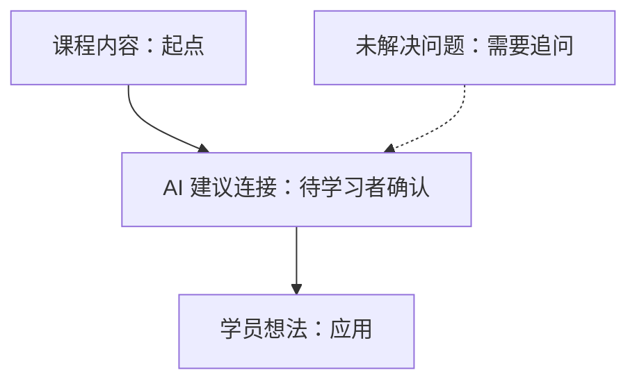

# Relationship-first visual guide

Read this only after the learner requests a visualization or selects the visual action. Identify the relationship in the persisted course material first, then offer two or three appropriate choices. A visual-selection request changes the state to `visual-choice`; generating, declining, or returning changes it back to `in-class` according to `state-machine.md`.

| Observable relationship | Suggestions |
|---|---|
| ordered steps or decision path | flowchart, decision tree |
| actors exchanging messages | sequence diagram, swimlane flow |
| causes of one outcome | fishbone, causal chain |
| events over time | timeline, sequence diagram |
| categories or trade-offs | comparison matrix, quadrant |
| parts of a whole | hierarchy, nested structure |
| cyclic reinforcement | causal loop, cycle diagram |

Use only relationships supported by the course capture. If the relationship is uncertain, say so and offer neutral alternatives rather than inventing links. In-class mind maps are optional; at close an editable mind-map draft is mandatory.

## Output contract

1. Offer two or three suggestions drawn from the table, stating the observed relationship and the entry IDs used. Persist the menu as `last_menu`; selection must not duplicate the capture.
2. When a diagram fits Mermaid, reserve a unique stable visual ID through the state machine's single-writer and retry identity procedure, then save editable source as `visuals/<visual-id>-<primary-source-entry-id>-<type>.md` (for example, `visuals/V001-N001-flowchart.md`). Keep it portable: use a fenced `mermaid` block and a text/table fallback in the same file.
3. If Mermaid does not fit or cannot render, still create an editable Markdown outline, table, or ASCII relationship description. Image generation, if available, is an enhancement only and never replaces the source.
4. A retry reuses the reserved `visual_id` and destination. A new requested visual receives a new ID even when it uses the same type and source entry; overwrite only when the learner explicitly asks to update that same `visual_id`. Link the created visual from the source note's `derived_artifacts`, then update the visual metadata and state only after the write succeeds.

## Provenance labels

Every visual and mind map must visibly distinguish these labels. Never collapse them into one unmarked graph.

| Label | Meaning |
|---|---|
| `课程内容` | A claim, term, or relationship captured from classroom material; cite note or concept entry IDs. |
| `学员想法` | The learner's reflection, example, or proposed connection. |
| `未解决问题` | A logged question that still needs course evidence or teacher input. |
| `外部来源` | Explicitly requested research, with URL and access date. |
| `AI 建议连接` | An inference offered for learner review; it is not course evidence. |

For Mermaid, encode the label in the node text (for example, `N1[课程内容：规模不等于护城河]`) and include a provenance table below it. For a fallback, use the same labels as column or outline prefixes.

## Portable visual file shape

````markdown
# <visual title>

- visual_id: V001
- filename: visuals/V001-N001-flowchart.md
- type: flowchart
- relationship: ordered steps or decision path
- source_entries: [N001, C001]
- created_at: <ISO 8601 time or unknown>
- status: draft

## Editable Mermaid



## Text fallback

| From | Relationship | To | Provenance |
|---|---|---|---|
| 课程内容：起点 | leads to | AI 建议连接：待学习者确认 | N001 |

## Provenance

| Element | Label | Evidence/reference |
|---|---|---|
| A | 课程内容 | N001 |
| B | AI 建议连接 | learner review required |
````

The nested Mermaid fence above is illustrative; in an artifact, use one outer Markdown document and one `mermaid` fence exactly as shown. Keep `mindmap.md` editable with this same label scheme and link every course-content node to an entry ID.
